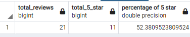
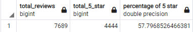

# Amazon_Vine_Analysis

#### The purpose of this analysis is to provide data for reviews written by members of the Amazong Vine program. This will show review information for Vine and non-Vine reviews. We have listed a few of the results we found below: 

    - There were 21 total reviews from Vine members and 7689 reviews from non-Vine members.*
    - There were 5 5-Star reviews from Vine members and 4444 5-Star reviews from non-Vine members.*
    - 52.4% of Vine member reviews were 5 stars.*
    - 57.8% of non-Vine members reviews were 5 stars.*

*This data has been filtered to show more helpful reviews.

#### Data for Vine Member Reviews: 

#### Data for the Non-Vine Member Reviews: 

#### Summary:
    It doesn't look there there is much of a bias for Vine members to be more likely to give a 5 star review than a non-Vine member. In fact non-Vine members seems to give a slightly higher percentage of 5 stars by 5%. Due to this it may seem as though companies should perhaps not pay the extra fee for Vine members. Before making this decision though it would be helpful to do an analysis on the percentage of 1 & 2 star reviews to see if Vine members are less likely to give bad reviews or if that is also the same amount as non-Vine members.

